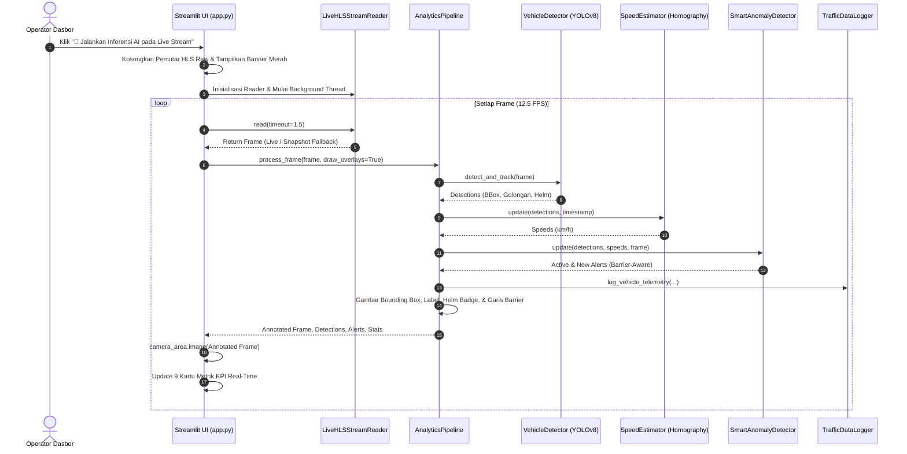

# DOKUMEN TAHAPAN SDLC 03: PERANCANGAN DAN ARSITEKTUR SISTEM (SYSTEM ARCHITECTURE AND DESIGN - SDD)

**Standar Dokumentasi:** Mengacu pada IEEE Std 1016-2009 (Standard for Information Technology - Systems Design - Software Design Descriptions)  
**Nama Sistem:** Smart CCTV Traffic Analytics & Anomaly Detection Architecture (Tri-Lokasi)  
**Versi:** 3.0 (Tri-Site Urban Corridor Edition)  
**Status:** Architecture Baseline  

---

## 1. PENDAHULUAN & PRINSIP ARSITEKTUR

### 1.1 Tujuan Dokumen
Dokumen Perancangan dan Arsitektur Sistem (*System Architecture and Design* - SDD) ini mendokumentasikan arsitektur struktural, dekomposisi komponen, pola komunikasi data, skema penyimpanan, serta rancangan antarmuka dari sistem analitik video CCTV cerdas.

### 1.2 Prinsip Perancangan (Design Principles)
Arsitektur sistem dibangun di atas 4 pilar rekayasa perangkat lunak utama:
1. **Loose Coupling & High Cohesion:** Setiap modul (ingestion, deteksi, estimasi kecepatan, deteksi anomali, logging data, dan antarmuka web) beroperasi secara modular dan independen.
2. **Producer-Consumer Threaded Pattern:** Pengunduhan video HLS dijalankan pada *background worker thread* dengan antrean aman (*thread-safe queue*) terpisah dari thread inferensi visual dan *rendering* UI.
3. **Zero-Blocking Fast Initial Paint:** Impor pustaka biner berat (*heavy dynamic libraries* seperti OpenCV dan PyTorch) menerapkan mekanisme *lazy-loading*, memungkinkan antarmuka web memuat seketika (< 1 detik).
4. **Resilient Fallback Mechanism:** Pipeline dirancang untuk tahan terhadap ketidakstabilan jaringan CCTV perkotaan dengan menyediakan *snapshot fallback* instan sehingga layar monitor tidak pernah mengalami *freeze* atau *blank*.

---

## 2. ARSITEKTUR SISTEM TINGKAT TINGGI (HIGH-LEVEL ARCHITECTURE)

Sistem mengadopsi pola arsitektur **Layered Modular Pipeline Architecture** yang terdiri dari 5 lapisan utama:

```
+-----------------------------------------------------------------------------+
|                      PRESENTATION LAYER (Streamlit Web UI)                  |
|  - Unified Camera Display (HLS Player / AI Annotated Stream)               |
|  - 3 CCTV Location Selector (Sudirman 282, Flyover MBK 190, Unila 312)      |
|  - 9 KPI Metric Cards (Volume Gol I-VI, Kecepatan, Insiden)                 |
|  - Real-time Telemetry & Incident Data Tables                               |
|  - Comparative Analytics Tab (Simpang vs Flyover vs Underpass)              |
+-----------------------------------------------------------------------------+
                                       ▲
                                       │ Frame & Telemetry Feed
+-----------------------------------------------------------------------------+
|                     ORCHESTRATION LAYER (pipeline.py)                       |
|  - TrafficAnalyticsPipeline: Mengkoordinasi deteksi multi-kamera,           |
|    pelacakan, estimasi kecepatan homografi, anomali, & data logging         |
+-----------------------------------------------------------------------------+
        ▲                       ▲                       ▲              ▲
        │ Detections            │ Speeds                │ Alerts       │ Logs
+---------------+       +---------------+       +---------------+  +----------+
|  DETECTION &  |       |  GEOMETRIC &  |       |  RULE-BASED   |  | STORAGE  |
| TRACKING LAYER|       |  SPEED LAYER  |       | ANOMALY LAYER |  |  LAYER   |
| (detector.py) |       |  (speed.py)   |       |(anomaly_det.py)| |(logger.py|
| - YOLOv8 Nano |       | - Homography  |       | - Collision   |  | - Tabular|
| - ByteTrack   |       |   Sudirman,   |       | - Fallen Motor|  |   CSV    |
| - Road ROI    |       |   MBK, & Unila|       | - Stopped Car |  | - Thread |
| - Golongan I-VI       | - Speed EMA   |       | - Barrier-    |  |   Safe   |
| - Helmet CV   |       | - Dimension m |       |   Aware 2-Way |  |   Buffer |
+---------------+       +---------------+       +---------------+  +----------+
                                       ▲
                                       │ Raw Video Frames
+-----------------------------------------------------------------------------+
|                     INGESTION LAYER (cctv_stream.py)                        |
|  - CCTVStreamManager: Multi-kamera HLS reader (282 Sudirman, 190 MBK, 312)  |
|  - LiveHLSStreamReader: Multi-threaded TS segment downloader & /tmp buffer   |
+-----------------------------------------------------------------------------+
                                       ▲
                                       │ HTTP/HLS m3u8 Stream
                        [Server CCTV Dishub Kota Bandar Lampung]
```

---

## 3. DEKOMPOSISI KOMPONEN SISTEM (SUBSYSTEM BREAKDOWN)

### 3.1 Sub-Sistem 1: Ingestion Aliran Video (`cctv_stream.py`)
- **Kelas `CCTVStreamManager`:**
  * Mengelola *opener* `urllib.request` dengan `CookieJar`.
  * Melakukan handshake inisialisasi sesi HLS (`index.m3u8` -> respon cookie -> `main_stream.m3u8`) dengan selector 3 kamera CCTV:
    - **CCTV ID 282 (Simpang Sudirman - Default/Primer)**
    - **CCTV ID 190 (Flyover Mall Boemi Kedaton - Baru)**
    - **CCTV ID 312 (Underpass Unila)**
  * Menyediakan metode `download_segment(seg_name)` dan `fetch_snapshot()` untuk ekstraksi frame darurat berlatensi rendah.
- **Kelas `LiveHLSStreamReader`:**
  * Menjalankan daemon thread `_download_worker` yang secara berkala memindai playlist HLS terbaru.
  * Mengunduh segmen video `.ts` langsung ke direktori `/tmp` SSD lokal (menghindari bottleneck Google Drive).
  * Melakukan ekstraksi frame menggunakan `cv2.VideoCapture` dengan rasio *sampling* 12.5 FPS yang sinkron dengan kapasitas inferensi model AI.
  * Menyimpan frame ke dalam `queue.Queue(maxsize=120)`.

### 3.2 Sub-Sistem 2: Deteksi, Tracking, & Klasifikasi (`detector.py`)
- **Fungsi Singleton `get_shared_yolo_model()`:** Memastikan model YOLOv8 Nano berbobot `yolov8n.pt` hanya dimuat satu kali ke dalam memori RAM (*shared cache*).
- **Kelas `VehicleDetector`:**
  * `road_roi`: Poligon batas jalan adaptif per lokasi:
    - `SUDIRMAN_ROAD_ROI`: Persimpangan 4 lajur Simpang Sudirman.
    - `MBK_ROAD_ROI`: Bentang aspal jembatan layang Flyover MBK (`[[320, 120], [920, 120], [1220, 720], [80, 720]]`).
    - `DEFAULT_ROAD_ROI`: Aspal terowongan Underpass Unila.
  * `is_in_roi(point)`: Menggunakan `cv2.pointPolygonTest` dengan toleransi jarak $\ge -45\text{ px}$.
  * `detect_and_track(frame, speed_estimator)`: Mengeksekusi inferensi YOLOv8 dengan pelacak `bytetrack.yaml` dan filter kelas kendaraan COCO.
  * `classify_indonesian_golongan(...)`: Memetakan hasil deteksi ke Golongan I, II, III, IV, V, VI-A, dan VI-B berdasarkan kelas COCO, estimasi dimensi meter, rasio aspek, dan deteksi helm.
- **Fungsi `detect_helmet(frame, bbox)`:**
  * Mengekstraksi ROI area kepala (15%–32% dari atas bounding box sepeda motor).
  * Melakukan thresholding warna kulit di ruang warna HSV dan YCbCr.
  * Menganalisis rasio luas kulit terhadap luas kepala, tingkat kebulatan (*contour circularity/convexity*), dan intensitas reflektansi kilau helm.

### 3.3 Sub-Sistem 3: Estimasi Geometris & Kecepatan (`speed_estimator.py`)
- **Kelas `SpeedEstimator`:**
  * Mempertahankan matriks homografi perspektif $\mathbf{H}_{3 \times 3}$ spesifik tri-lokasi:
    - **Simpang Sudirman (CCTV ID 282):** Titik piksel `[[380, 190], [760, 190], [800, 710], [120, 710]]` dipetakan ke bidang meter $12.0 \times 28.0\text{ m}$ (`[[0,0], [12,0], [12,28], [0,28]]`).
    - **Flyover Mall Boemi Kedaton (CCTV ID 190):** Titik piksel `[[410, 160], [860, 160], [930, 710], [180, 710]]` dipetakan ke bentang meter $10.0 \times 30.0\text{ m}$ (`[[0,0], [10,0], [10,30], [0,30]]`).
    - **Underpass Unila (CCTV ID 312):** Titik piksel `[[240, 150], [410, 150], [650, 680], [180, 680]]` dipetakan ke bidang meter $7.5 \times 45.0\text{ m}$ (`[[0,45], [7.5,45], [7.5,0], [0,0]]`).
  * Menghitung kecepatan instan berdasarkan pergeseran posisi fisik $\Delta d = \sqrt{(X_2 - X_1)^2 + (Y_2 - Y_1)^2}$ dibagi selisih waktu $\Delta t$.
  * Mengaplikasikan penghalus *Exponential Moving Average (EMA)* dengan koefisien $\alpha = 0.35$ untuk menekan derau getaran kamera.

### 3.4 Sub-Sistem 4: Mesin Deteksi Anomali Multi-Lokasi (`anomaly_detector.py`)
- **Kelas `SmartAnomalyDetector`:**
  * Menerima deteksi objek, data kecepatan, dan frame visual dari setiap siklus pipeline.
  * **Logika Spesifik Tri-Lokasi:**
    - **Simpang Sudirman (CCTV 282):** Deteksi tabrakan persimpangan ($\text{IoU} > 0.45$), antrean kemacetan lampu merah terhenti $> 3.0\text{ s}$, dan pergerakan lawan arus.
    - **Flyover Mall Boemi Kedaton (CCTV 190):** Deteksi kendaraan mogok/berhenti di atas bentang layang (bahaya kritis tabrakan beruntun pada jalur menerus), sepeda motor tergelincir pada siar muai (*expansion joint*), serta *overspeeding* turunan layang.
    - **Underpass Unila (CCTV 312):** Menggunakan fungsi linear pembatas fisik median:
      $$x_{\text{barrier}}(y) = 110.0 + 65.0 \times \left(\frac{y}{720.0}\right)$$
      Memvalidasi arah pergerakan:
      - Lajur Kanan: Legal jika $\Delta y > 0$ (turun). Anomali lawan arah jika $\Delta y < -25\text{ px}$.
      - Lajur Kiri: Legal jika $\Delta y < 0$ (naik). Anomali lawan arah jika $\Delta y > 25\text{ px}$.
      - Anomali menyeberang barrier (*barrier crossing*).
  * Mengevaluasi kondisi umum: tabrakan ($\text{IoU} > 0.45$), motor terjatuh ($\text{AR} > 1.30$), dan kendaraan terhenti.
  * Menghasilkan objek alert lengkap dengan ID unik, tingkat keparahan (CRITICAL/WARNING), dan bukti tangkapan layar (*snapshot thumbnail*).

### 3.5 Sub-Sistem 5: Logging Data Telemetri & Insiden (`data_logger.py`)
- **Kelas `TrafficDataLogger`:**
  * Menulis berkas log `logs/traffic_telemetry.csv` dan `logs/incident_records.csv`.
  * Menggunakan thread lock `threading.Lock()` untuk menjamin integritas konkurensi data (*thread safety*).
  * Dilengkapi fungsi *caching* biner cepat `get_raw_csv_bytes()` pada `app.py` untuk mengeliminasi keterlambatan unduh data di antarmuka web.

### 3.6 Sub-Sistem 6: Orkes Pipeline & Dasbor UI (`pipeline.py` & `app.py`)
- **Kelas `UnderpassAnalyticsPipeline`:** Mengintegrasikan detektor, estimator kecepatan, detektor anomali, dan logger data ke dalam satu fungsi eksekusi: `process_frame(frame, draw_overlays=True)`.
- **Modul `app.py`:** Antarmuka Streamlit modern dengan pola *Unified Camera Area*:
  * Komponen `camera_area = st.empty()` yang dapat menampilkan pemutar HTML5 langsung atau beralih secara instan menampilkan frame teranotasi AI lengkap dengan *bounding box*, label golongan, status helm, kecepatan, dan garis pemisah barrier.

---

## 4. DIAGRAM INTERAKSI & SEQUENCE SISTEM

### 4.1 Diagram Alir Siklus Inferensi AI Real-Time


---

## 5. SKEMA DAN STRUKTUR BASIS DATA TABULAR (CSV SCHEMAS)

### 5.1 Skema Berkas Telemetri: `logs/traffic_telemetry.csv`
Berkas ini menyimpan rekaman pergerakan mikro setiap kendaraan per frame pengamatan:

| Nama Kolom | Tipe Data | Deskripsi Atribut | Contoh Nilai |
| :--- | :--- | :--- | :--- |
| `frame_id` | Integer | Nomor sekuensial frame analisis | `142` |
| `timestamp_iso` | String | Waktu pencatatan format ISO 8601 | `2026-09-19T16:30:15.120+07:00` |
| `timestamp_epoch`| Float | Waktu presisi tinggi epoch UNIX | `1789810215.12` |
| `track_id` | Integer | ID unik pelacakan kendaraan ByteTrack | `12` |
| `golongan` | String | Klasifikasi Golongan Standar Indonesia | `Golongan VI-A` |
| `vehicle_subclass`| String | Sub-kategori kendaraan spesifik | `Sepeda Motor (Taat Helm)` |
| `confidence` | Float | Nilai keyakinan deteksi YOLOv8 (0–1) | `0.88` |
| `bbox_x1`, `y1`, `x2`, `y2`| Integer | Koordinat kotak pembatas pada frame | `310, 420, 360, 510` |
| `pixel_center_x`, `y` | Float | Titik tengah geometris bounding box | `335.0, 465.0` |
| `ground_x_m`, `y_m` | Float | Koordinat fisik dunia nyata (meter) | `4.25, 28.60` |
| `length_m`, `width_m` | Float | Estimasi dimensi fisik kendaraan | `1.95, 0.75` |
| `speed_kmh` | Float | Estimasi kecepatan translasi aktual | `44.5` |
| `aspect_ratio` | Float | Rasio perbandingan lebar terhadap tinggi | `0.55` |
| `helmet_status`| String | Atribut kepatuhan: HELM / TANPA_HELM | `HELM` |
| `compliance_status`| String | Kategori hukum: TAAT_HUKUM / MELANGGAR | `TAAT_HUKUM` |
| `status` | String | Kondisi operasional: NORMAL / CRITICAL | `NORMAL` |
| `location_id` | Integer | ID Kamera CCTV Dishub | `282` |
| `location_name`| String | Nama lokasi titik pemantauan | `CCTV Perempatan Jendral Sudirman`|

### 5.2 Skema Berkas Insiden: `logs/incident_records.csv`
Berkas ini mencatat kejadian anomali, kecelakaan, dan pelanggaran hukum lalu lintas:

| Nama Kolom | Tipe Data | Deskripsi Atribut | Contoh Nilai |
| :--- | :--- | :--- | :--- |
| `incident_id` | String | Pengenal unik insiden (UUID/Hash) | `INC_20260919_282_001` |
| `timestamp_iso` | String | Waktu terjadinya insiden (ISO 8601) | `2026-09-19T16:32:44.200+07:00` |
| `incident_type` | String | Tipe: COLLISION, WRONG_WAY, STOPPED | `COLLISION` |
| `severity` | String | Tingkat keparahan: CRITICAL / WARNING | `CRITICAL` |
| `involved_track_ids`| String | Daftar ID kendaraan yang terlibat | `[8, 11]` |
| `golongan_types` | String | Golongan kendaraan yang terlibat | `['Golongan I', 'Golongan VI-A']` |
| `speed_kmh` | Float | Kecepatan kendaraan saat insiden | `2.4` |
| `location_desc` | String | Lokasi insiden secara deskriptif | `CCTV Perempatan Jendral Sudirman`|
| `title` | String | Judul singkat notifikasi alert | `Tabrakan Kendaraan Persimpangan`|
| `description` | String | Keterangan kronologi teknis kejadian | `Benturan sudut silang antara sedan dan motor di simpang`|

---

## 6. RANCANGAN PEMBERSIHAN KODE (*CLEAN CODE ARCHITECTURE*)

Berdasarkan tinjauan performa sistem, arsitektur kode telah dioptimalkan secara ketat:
1. **Eliminasi Dead Code:** Menghapus fungsi warisan *sample recording* dan *synthetic demo simulation* (`run_video_file` dan `run_simulation_demo`), mengurangi ukuran `app.py` sebesar 28% (dari 1012 baris menjadi 728 baris).
2. **Eliminasi File Watcher Polling:** Menonaktifkan pemindaian berkas internal Streamlit (`fileWatcherType = "none"`) yang sebelumnya memeriksa 10.300 berkas di Google Drive setiap detik.
3. **Penyatuan Komponen Penampil:** Menggantikan keberadaan komponen ganda yang membingungkan dengan satu placeholder reaktif `camera_area` yang beralih status secara mulus antara mode pratinjau langsung dan mode inferensi AI beranotasi.
